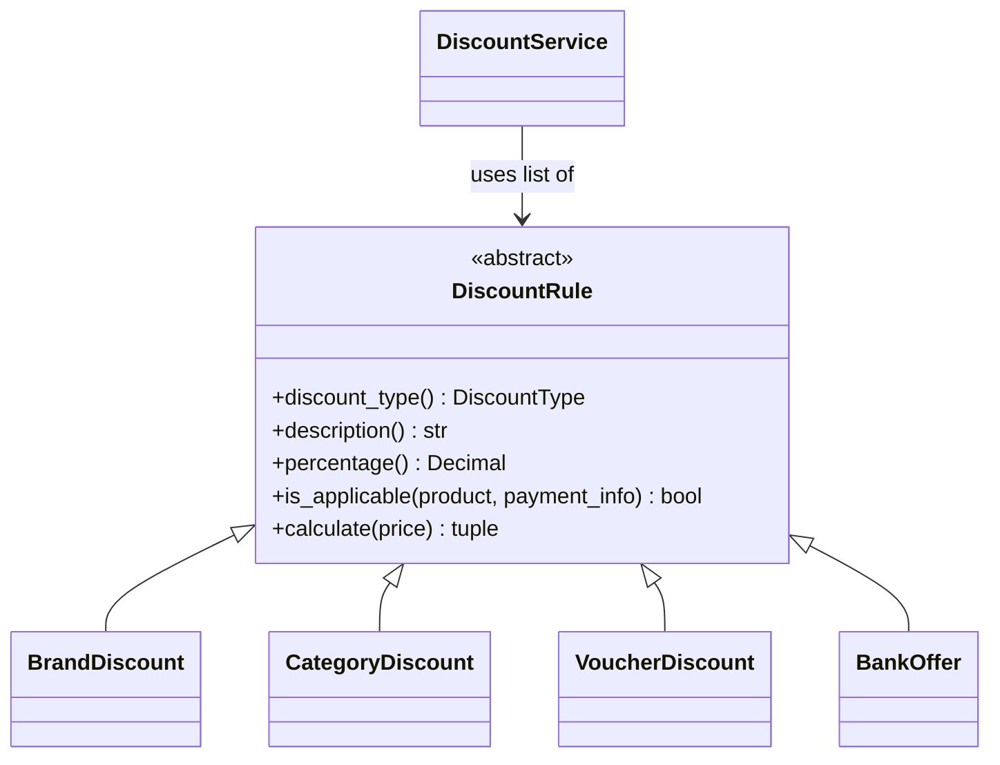

# Unifize — Fashion E-Commerce Discount Service

A discount calculation engine for a fashion e-commerce platform supporting four
discount types with deterministic stacking order.

## Quick Start

```bash
# Create a virtual environment
python3 -m venv .venv && source .venv/bin/activate

# Install dependencies
pip install -r requirements.txt

# Run the demo
python main.py

# Run tests
pytest -v
```

## Discount Types

| Type | Example | Scope |
|------|---------|-------|
| Brand | "Min 40% off on PUMA" | All products of a brand |
| Category | "Extra 10% off on T-Shirts" | All products in a category |
| Voucher | `SUPER69` → 69% off | Any product |
| Bank Offer | "10% instant discount on ICICI" | Payment-method gated |

## Stacking Order

Discounts are applied **sequentially** — each tier reduces the running price
before the next tier is calculated:

```
MRP
 │
 ├─ 1. Brand discount        (on MRP)
 ├─ 2. Category discount      (on brand-discounted price)
 ├─ 3. Voucher code           (on further-reduced price)
 └─ 4. Bank offer             (applied last)
 │
 ▼
Final Price
```

**Example — PUMA T-Shirt (MRP ₹1 499) with ICICI card:**

| Step | Discount | Amount | Running Price |
|------|----------|--------|--------------|
| Brand 40% | ₹599.60 | ₹899.40 |
| Category 10% | ₹89.94 | ₹809.46 |
| Bank 10% | ₹80.95 | **₹728.51** |

Total saving: ₹770.49 (51.40% off MRP)

## Architecture

```
models.py       ← Data classes (Product, CartItem, PaymentInfo, DiscountedPrice)
discounts.py    ← Discount rules (Strategy pattern — one class per type)
service.py      ← DiscountService (orchestration + stacking logic)
fake_data.py    ← Sample products, rules, and payment profiles
main.py         ← CLI demo
tests/          ← pytest suite
```

**Key design decision — Strategy pattern for discount rules:**
Each discount type is a separate class extending `DiscountRule`. This makes it
trivial to add new discount types (e.g. loyalty points, buy-one-get-one) without
modifying the service's stacking logic.



## Assumptions

1. **Best-in-tier wins** — If multiple brand discounts apply to the same product,
   only the highest-percentage one is used (same within each tier).
2. **Per-unit pricing** — Discounts are calculated on the unit MRP; quantity
   only affects the line total, not the discount percentage.
3. **Sequential compounding** — Each tier's percentage applies to the *already
   discounted* price, not the original MRP. This is standard in Indian
   e-commerce (Myntra, Flipkart).
4. **Decimal arithmetic** — All money values use Python's `Decimal` with
   `ROUND_HALF_UP` to avoid floating-point drift.
5. **Voucher is universal** — A valid voucher code applies to every item in the
   cart (no product restrictions).
6. **Bank offers require payment info** — If no payment information is supplied,
   bank offers are silently skipped (not an error).

## Technical Decisions

- **No external dependencies** beyond `pytest` — the service is pure Python
  stdlib (`dataclasses`, `decimal`, `abc`, `enum`).
- **`Decimal` with `ROUND_HALF_UP` for all money** — `float` cannot represent
  0.1 exactly in binary; compound discounts amplify the drift. `Decimal` is
  the standard for financial calculations in Python.
- **`CardType` and `DiscountType` enums** — raw strings for card type and
  discount tier allow silent typos and give no IDE support. Enums constrain
  values at definition time and simplify membership checks.
- **`DiscountBreakdown` audit trail** — every applied discount records its
  `price_before`, `price_after`, `amount`, and `description`. Callers can
  render a full discount ladder to the user, not just the final price.
- **Frozen dataclasses** for immutable value objects (`Product`, `PaymentInfo`,
  `DiscountBreakdown`, discount rules) — prevents accidental mutation.
- **Fail-fast voucher validation** — an invalid code raises `ValueError`
  *before* any discount calculation begins, giving the caller a clear error.
- **Type hints throughout** — enables static analysis and IDE support.
